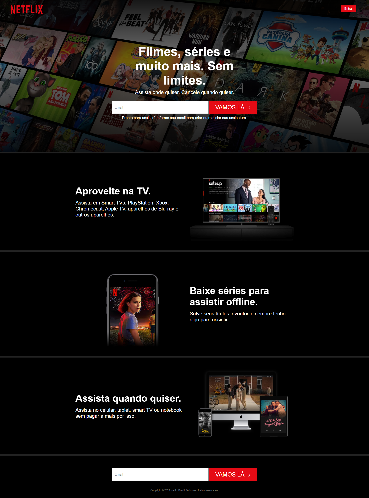

# 🎬 Netflix Clone

Clone da página inicial da Netflix Brasil, desenvolvido durante meus estudos de HTML e CSS.

---

## 🖼️ Preview

---

## 🖥️ Sobre o projeto

Recriação da landing page da Netflix com foco em praticar estruturação HTML e estilização CSS, incluindo layout com Grid, gradientes e vídeos em background.

---

## ✨ Funcionalidades

- Layout fiel à página original da Netflix Brasil
- Vídeos em loop nas seções (igual ao site real!)
- Header com logo e botão de entrar
- Formulário de CTA (Call to Action)
- Seções de features com imagens e vídeos
- Footer completo

---

## 🛠️ Tecnologias utilizadas

---

## 📚 O que aprendi

- Estruturação semântica com HTML5
- CSS Grid para layouts complexos
- Uso de gradientes com CSS
- Incorporação de vídeos em loop
- Organização de arquivos em projeto web

---

## ⚠️ Observações

- Projeto desenvolvido para fins de estudo, sem fins comerciais
- Não possui responsividade (mobile)
- Imagens e vídeos pertencem à Netflix

---

Desenvolvido por <a href="https://github.com/leviroiz">Carlos Levi</a> durante os estudos de desenvolvimento web 🚀

